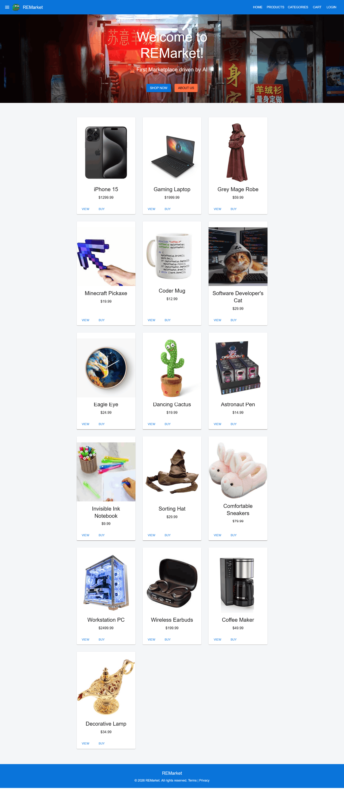
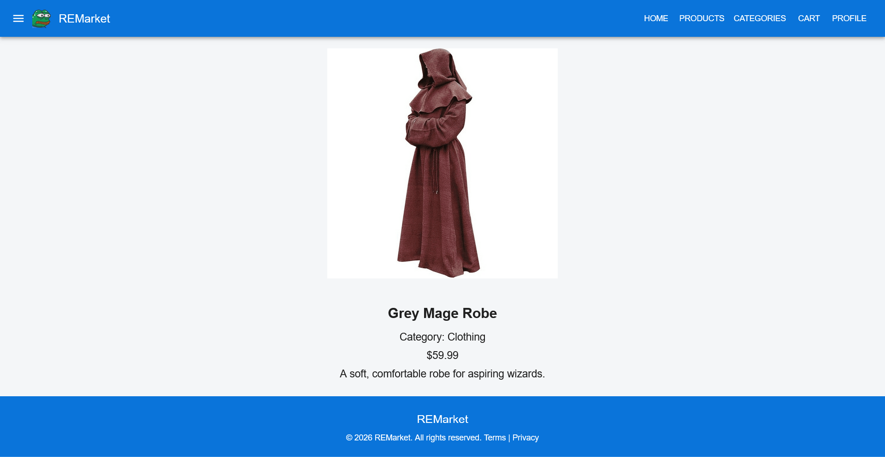
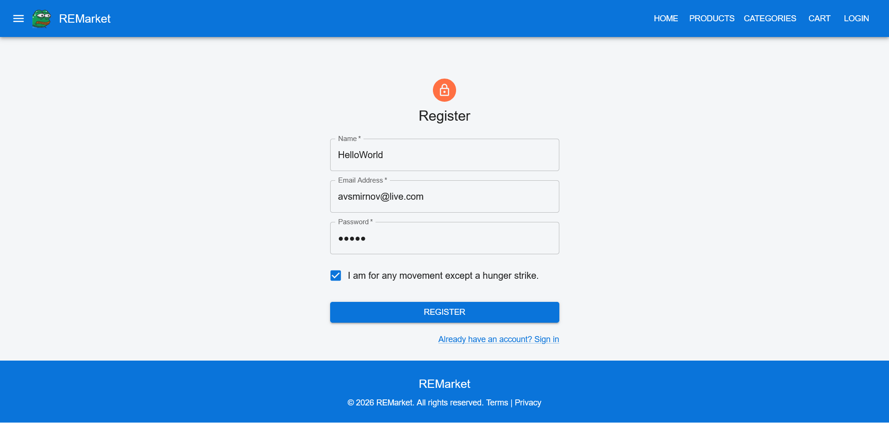

# REMarket – Full-Stack Marketplace Prototype

## Overview

This project is a full-stack marketplace prototype designed to explore a modern production-like architecture using **Next.js (frontend)** and **NestJS (backend)** with **Prisma ORM** and **JWT-based authentication**.

The objective was not to build a production application, but to simulate a scalable e-commerce system with clearly separated frontend and backend layers, authentication flow, and structured data access through an ORM.

---

## Architecture

- **Frontend**: Next.js 15 (React-based SSR/SPA hybrid)
- **Backend**: NestJS 10 (modular REST API architecture)
- **Database layer**: Prisma ORM
- **Authentication**: JWT (Passport strategy)
- **Styling**: TailwindCSS + DaisyUI
- **External services**: Supabase (SDK integration where applicable)

---

## Key Features

- JWT-based authentication (register / login flow)
- Protected API routes using NestJS guards
- Modular backend structure (users, products, cart, auth modules)
- Prisma-based data modeling and database abstraction
- SSR-ready frontend built with Next.js
- UI implemented with TailwindCSS and DaisyUI
- Axios-based API communication layer
- Integration-ready architecture for external services (Supabase)

---

## Tech Stack

### Frontend
- Next.js 15
- React 19 (RC)
- TailwindCSS
- DaisyUI
- Axios

### Backend
- NestJS 10
- Express adapter (Nest platform)
- Passport + JWT authentication
- bcrypt (password hashing)
- Prisma ORM
- RxJS (reactive patterns within NestJS)

### Database / Services
- Prisma Client
- Supabase (optional integration layer)

---

## Project Structure

### Frontend
- `app/` / `pages/` – routing and UI views
- `components/` – reusable UI components
- `lib/` – API client layer and utilities
- `styles/` – Tailwind configuration and global styles

### Backend
- `modules/` – feature-based modules (auth, users, products, cart)
- `controllers/` – request handlers
- `services/` – business logic layer
- `prisma/` – schema definition and migrations
- `guards/` – authentication and authorization logic

---

## Screenshots

### Marketplace UI

  

### Product Flow

  
  

### Cart & Checkout

  
  

### Auth Flow

  
  

## Notes

This project was developed as a full-stack architecture exploration to simulate a scalable marketplace system using modern TypeScript-based tooling.

### Focus areas:

- separation of frontend/backend concerns
- authentication flow design
- ORM-based data modeling
- SSR + API hybrid structure